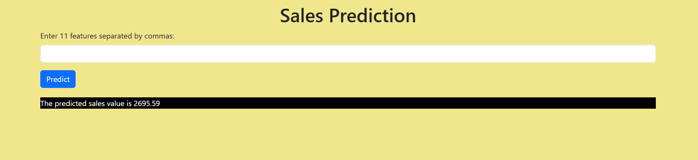

# 📈 Sales Prediction  

A machine learning project for predicting sales using **XGBRegressor**, built with Python. The model leverages historical sales data and features to make accurate predictions and help in data-driven decision making.  

  

---

## 🔗 Live Demo  

Check out the live notebook/project here:  
👉 [Link](https://github.com/delljigyanshu/Sales-prediction)  

---

## ✨ Features  

- 📊 *Data preprocessing* and feature engineering on sales dataset  
- 🤖 *XGBRegressor model* for regression-based prediction  
- 📈 *Evaluation metrics* (MAE, MSE, RMSE, R²) for performance check  
- 📉 *Visualization of sales trends* using Matplotlib  
- ⚡ *Efficient & accurate* regression pipeline  

---

## 📦 Project Structure  

sales-prediction/
├── sales.csv # Dataset used for training/testing
├── sales_prediction.ipynb # Jupyter Notebook with model & analysis
├── model.pkl # Saved XGBRegressor model
├── requirements.txt # Required dependencies
└── README.md # Project documentation


---

## 🚀 Getting Started  

1. **Clone the repository**  
   ```bash
   git clone https://github.com/delljigyanshu/Sales-prediction.git
   cd Sales-prediction
   
2. Install dependencies
 ```bash
  pip install -r requirements.txt
```

3.  Run the notebook
```bash
  Open sales_prediction.ipynb in Jupyter Notebook / Jupyter Lab.
  Execute the cells step by step to preprocess data, train, evaluate, and test predictions.
```

## 🛠 Built With
- Python 🐍
- Pandas
- NumPy
- Matplotlib
- Scikit-learn
- XGBoost (XGBRegressor)
- Jupyter Notebook

## ✏ Customization Ideas

📊 Add interactive dashboards with Plotly or Power BI
🔍 Experiment with other regression models (Linear Regression, Random Forest, LightGBM)
🌐 Deploy as a Flask/Django web app for real-time sales prediction
📡 Connect with live sales data API for dynamic predictions

## 🙋‍♂ Author

Jigyanshu Agrawal
GitHub: [@delljigyanshu](https://github.com/delljigyanshu)
LinkedIn: [Jigyanshu Agrawal](https://www.linkedin.com/in/jigyanshu-agrawal?utm_source=share&utm_campaign=share_via&utm_content=profile&utm_medium=android_app)
